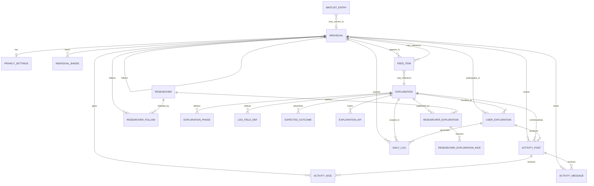
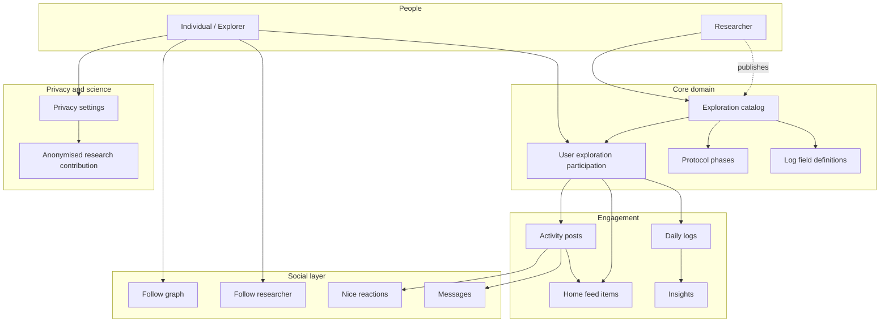

# Kind data model

Conceptual data model for the Kind health-exploration platform, derived from the mobile web prototype (`apps/mobile/prototype.html`) and marketing site waitlist flows (`apps/kind-website/`).

**Related files**

- SQL schema: [`kind-schema.sql`](./kind-schema.sql)
- PDF: generate with `node docs/scripts/generate-kind-data-model-pdf.mjs`

---

## Overview

Kind has two primary person types:

| Role | Description |
|------|-------------|
| **Individual (explorer)** | Runs N-of-1 health explorations, logs daily data, follows peers and researchers, controls privacy/consent |
| **Researcher** | Publishes or collaborates on explorations, builds reputation, followed by individuals |

**Exploration** is the central catalog entity: protocol phases, log field definitions, expected outcomes, and participation records hang off it.

---

## Entity-relationship diagram

---

## High-level architecture

---

## Entities and attributes

### Individual (explorer)

Session user in the prototype is **Emma Green** (profile tab). Community members appear as full profiles (`COMM_USERS`), list rows (`BASIC_USERS`), or follower-only entries (`FOLLOWER_ONLY`).

| Attribute | Source |
|-----------|--------|
| `id` (slug) | e.g. `sam-johnson` |
| `name`, `location`, `bio` | Profile panel |
| `avatar_image_id`, `initials` | Avatar helper |
| `profile_meta` | e.g. "Week 3 · Caffeine & sleep" |
| `is_follower_of_viewer` | `follower` flag on profile |

### Privacy settings

Profile **Data & privacy** toggles:

- Contribute to citizen science (anonymised research)
- Visible in community
- Daily reminders

### Exploration (catalog)

Defined in `EXPLORATIONS`: caffeine, movement, eating, stress, supplements, screen (+ treatment coming soon in UI).

| Attribute | Example |
|-----------|---------|
| `title`, `icon`, colours | Caffeine & sleep quality, ☕ |
| `duration_label` | 8-week protocol |
| `description`, `participant_count` | Community size |
| `catalog_active` | Active vs available badge |
| `status_badge`, `progress_percent`, `streak_days` | Active run (Emma on caffeine) |
| `phases[]` | Baseline → intervention → report |
| `fields[]` | range, select, checks, number |
| `outcomes[]` / `kpis[]` | Marketing vs live stats |
| `chart[]` | Sleep quality last 7 days |

### User exploration (participation)

Links an individual to a catalog exploration with progress:

- `week_current`, `weeks_total`, `status` (active | complete)
- Implied streak and start date on active runs

`EXPLORATION_FOLLOWERS` in the prototype is a **denormalised view** of who is on each exploration (query `user_explorations`).

### Daily log

Today's log form on exploration detail; values keyed by `log_field_def.field_key` (e.g. `cf_sleep`, `cf_mg`).

### Activity post

Profile **Recent activity** and feed cards: summary text, metrics detail, exploration label, `nice_count` base + viewer nice.

### Researcher

`RESEARCHERS`: name, title, organisation, `research_areas[]`, `verified`, linked explorations with collaboration note.

### Social interactions

| Interaction | Storage pattern |
|-------------|-----------------|
| Follow explorer | `individual_follows` (asymmetric) |
| Follow researcher | `researcher_follows` |
| Nice on activity | `activity_nices` (per viewer + post index → post id) |
| Message on activity | `activity_messages` |
| Nice on researcher exploration | `researcher_exploration_nices` |

### Feed item

Home feed polymorphic types: `milestone`, `insight`, `activity`, `science`, `tip` — reference actor individual and/or exploration.

### Waitlist entry (website)

Individuals and researchers pages capture first name, email, and (individuals) self-description type. Not yet wired to API in prototype.

---

## Prototype mapping

| Prototype construct | Model entity |
|---------------------|--------------|
| `EXPLORATIONS` | `explorations` + child tables |
| `COMM_USERS` / `BASIC_USERS` | `individuals` (rich vs minimal) |
| `RESEARCHERS` | `researchers` |
| `followingSet` | `individual_follows` |
| `followingResearchersSet` | `researcher_follows` |
| `nicedSet` | `activity_nices` |
| `nicedResearcherExp` | `researcher_exploration_nices` |
| `EXPLORATION_FOLLOWERS` | View over `user_explorations` |
| Profile privacy toggles | `privacy_settings` |
| Explore chat / search | Read-only over catalog + community |

---

## Integration with existing API schema

The monorepo already has `infra/db/migrations/` with `users`, `protocols`, and `user_protocols` for the React mobile app. This Kind model is **conceptually aligned** but uses exploration-centric naming from the prototype. A future migration could:

- Map `individuals.id` → `users.id` (UUID)
- Map `explorations.id` (slug) → new catalog table or extend `protocols`
- Retire duplicate concepts once the prototype and API converge

---

## Design notes

1. **Participation is first-class** — catalog item vs one person's run (`user_explorations`).
2. **Log schema is per exploration** — `log_field_defs` drive dynamic forms; values stored as JSONB per day.
3. **Social is explorer-centric** — researchers use a parallel follow + nice-on-exploration pattern.
4. **Privacy gates research** — citizen science and community visibility are explicit consent before aggregation.
