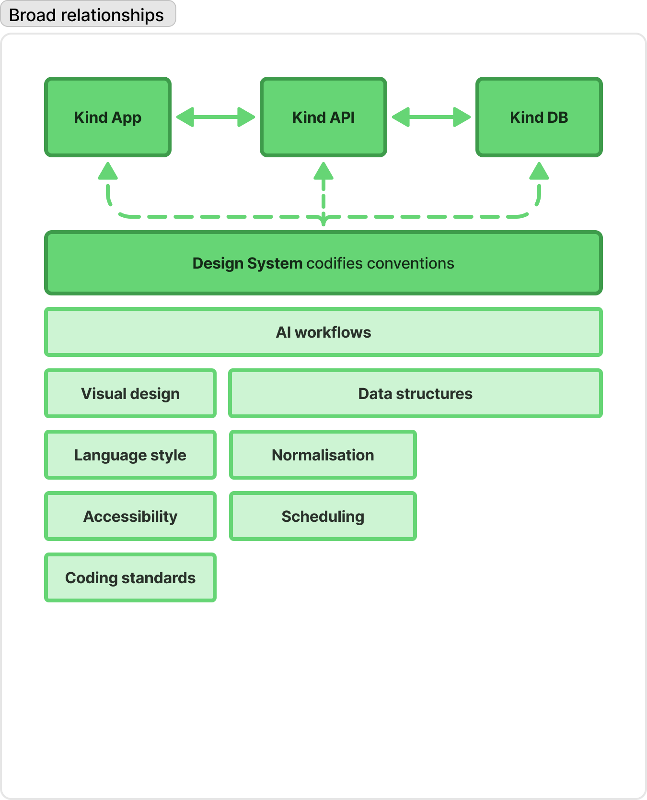
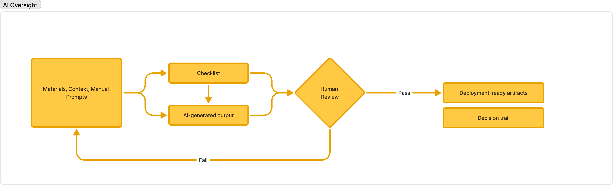
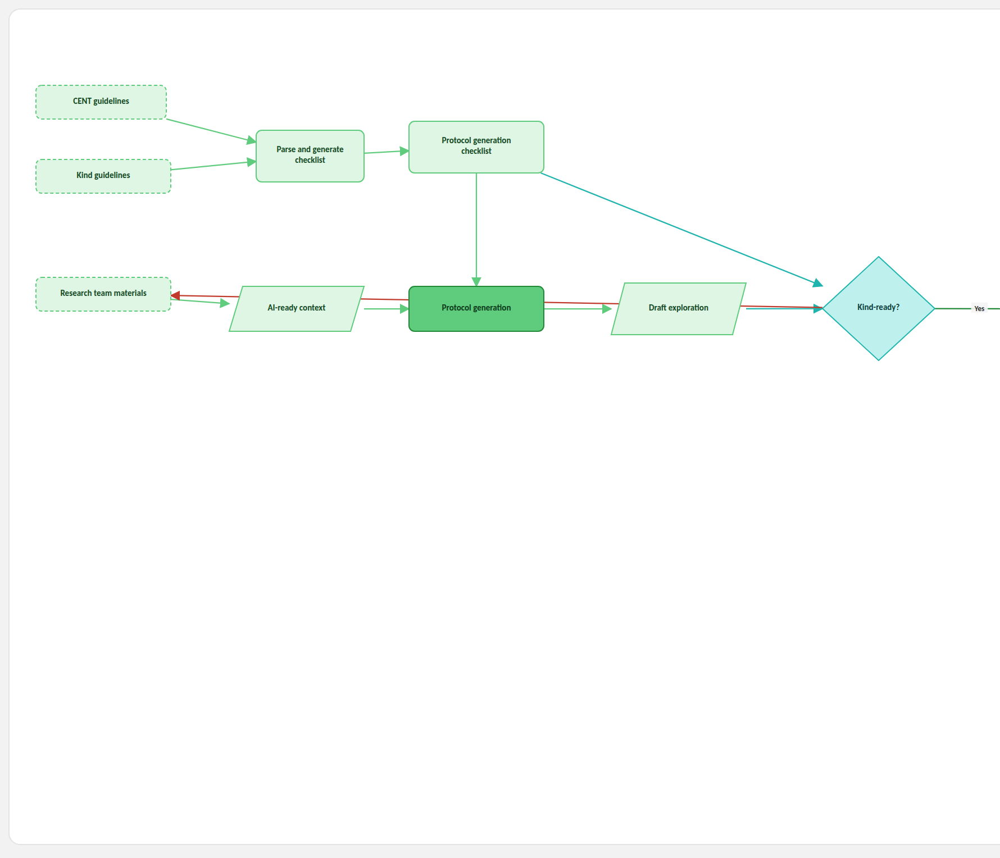
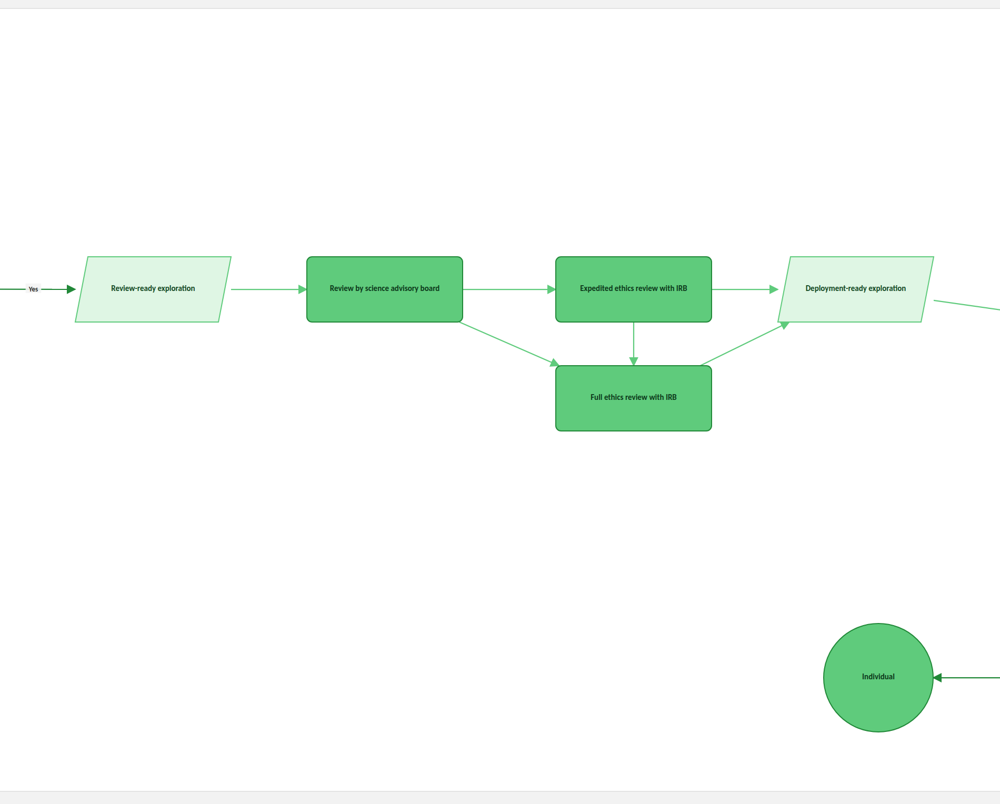
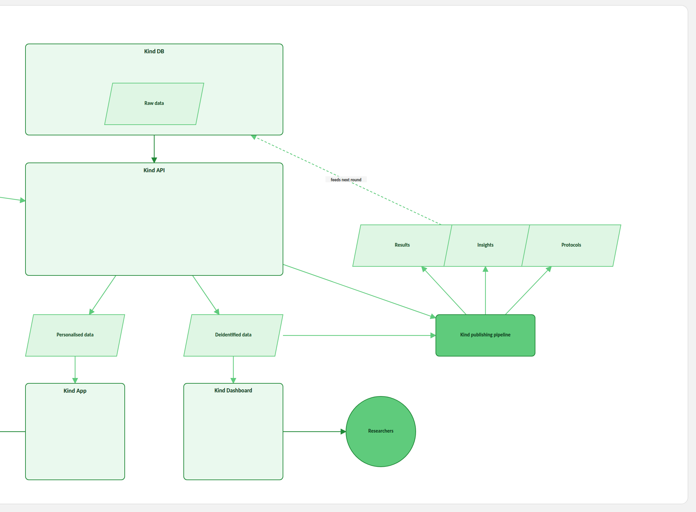
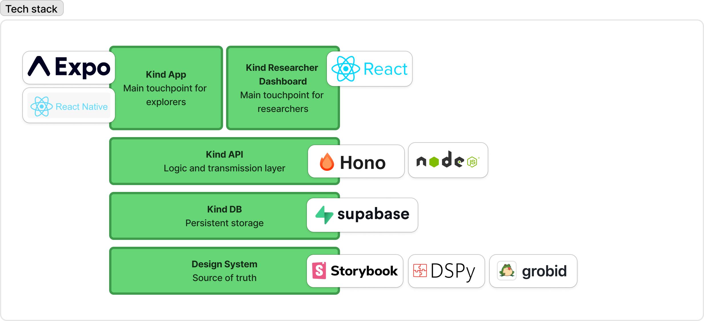

# THE KIND SYSTEM

### Rules for Building, Reviewing, and Deploying Features

A controlled document governing feature development, the design system, AI-generated output, and the research protocol pipeline at Kind.

*Version 0.1 — Draft for review — 28 August 2026*

---

## 0. Purpose and Scope

This document is the governing specification for how Kind builds, reviews, and deploys features across its product, its design system, and its research pipeline. It applies to every contributor and every automated agent operating on Kind's codebase, design system, or protocol-generation tooling.

Kind makes extensive use of artificial intelligence: to generate and revise interface code, to draft and revise design-system components, and to convert published research into deliverable exploration protocols. This document exists because that extent of AI use does not reduce the need for rigor — it increases it. A process is not auditable because a human could, in principle, explain what happened. It is auditable because every material decision, human or AI, leaves a record that a third party can reconstruct without asking anyone what they meant.

Three properties are required of every process described below, without exception:

- **Determinism where determinism is possible.** The same inputs, run through the same gate, produce the same class of output. Where AI introduces variability, that variability is bounded and reviewed, not left open.
- **A named human accountable** for every output that reaches a participant, a researcher, or production. "The AI generated it" is not a disposition.
- **A retained decision trail** for every artifact that passes a gate, sufficient to answer, after the fact, what was reviewed, by whom, against what standard, and why it passed or failed.

Sections 1 and 5 describe Kind's system architecture and technical infrastructure. Sections 2 through 4 describe the three governed workflows: the design system, AI-generated output in general, and the exploration (research protocol) pipeline specifically. Section 6 defines terms used throughout. Where a workflow at Kind is benchmarked against an external precedent, that precedent is described alongside the rule it substantiates, not collected into a separate literature review — the point is not that other companies have done something similar; it is that the specific mechanism Kind requires has already been shown, elsewhere, to hold up under real operating conditions.

### 0.1 Human-in-the-Loop Touchpoints

AI participates in generation at every stage of this document. It is never permitted to participate in the decision that a generated artifact is fit to ship. That decision is reserved, at every stage, for a named human or a named human body. The table below is a single index of every point in this document where that reservation applies; each is also marked inline, where it occurs, with a 👤 **HUMAN-IN-THE-LOOP** callout.

| # | Touchpoint | Who decides | What is decided | Section |
|---|---|---|---|---|
| 1 | Design System change review | Code reviewer (someone other than the author) | Whether a code-level change to the Design System merges | 2.2.1 |
| 2 | Design System visual sign-off | Design reviewer + two developer approvers; merge restricted to named maintainers | Whether a visual change to the Design System merges | 2.2.2 |
| 3 | New component/pattern review | Kind's scheduled design-system review session | Whether a new component or pattern is accepted into the Design System | 2.2.3 |
| 4 | AI Oversight Gate review | A named human reviewer, assigned per artifact type | Pass/Fail on every AI-generated artifact, before it may be called deployment-ready | 3.1.3 |
| 5 | Kind-readiness determination | Same reviewer role as Touchpoint 4, applying the Section 4.1 checklist | Pass/Fail on whether a draft exploration is Kind-ready | 4.2 |
| 6 | Science advisory board review | Kind's science advisory board | Scientific sign-off on a review-ready exploration, before any ethics review begins | 4.3 |
| 7 | IRB determination | Institutional Review Board (expedited or full track) | Formal ethics clearance; required before any exploration reaches an individual | 4.3 |

No artifact, code change, exploration protocol, or dataset skips from AI generation directly to production, App, or Dashboard without passing through at least one row of this table. Sections 4.4's data-handling controls (deidentification, routing) are, by contrast, deliberately automated and technical rather than human-adjudicated — that distinction is intentional and is called out where it occurs, so that "human-reviewed" is never claimed for a step that is actually a fixed technical control.

### 0.2 Rules That Bind Machines, Not Just People

The design systems benchmarked throughout this document — Section 2.2's Shopify Polaris, IBM Carbon, and Atlassian Design System among them — are, in the end, governance built around human contributors. A contributor reads a contribution guide, a style guide, a component spec; a reviewer checks whether what was submitted follows it; deviation is caught, if it is caught, after the fact, at review. The guide itself does nothing to a contributor who has not read it, has misread it, or decides a particular case warrants an exception.

Kind's rules are written to be read by both. Every document referenced in this system — the Design System, language style guides, protocol-generation checklists, AI agent instructions — is authored to be directly consumable by an agent at runtime, not only by a person in advance of writing code. This is a different claim from "Kind uses AI to help build things." Kind does not put a general-purpose model into its codebase, design system, or protocol pipeline and trust it to have absorbed the rules the way a new hire eventually does. Each agent is given an explicit, scoped instruction set before it is inserted into a task: what information it is permitted to draw on, what methods it is permitted to use, and when it is permitted to use them. An agent generating a component is not holding the whole Design System in an undifferentiated context window and hoping the relevant part surfaces — it is handed the specific, version-controlled rules that govern that task, in the same form the AI Oversight Gate in Section 3 requires it to declare as its inputs (Rule 3.1.1).

> **Rule 0.2.1.** No AI agent operates on Kind's codebase, design system, or protocol-generation tooling under general, unconstrained model access. Every such agent is given a scoped, version-controlled instruction set — defining the information and methods available to it, and when each applies — before it is inserted into a task.

This is what makes the human-in-the-loop cycle in Section 0.1 iterative rather than merely repeated: the same instruction set an agent was constrained by is available for a human reviewer to check the agent's output against, and a failure at any Section 0.1 touchpoint can be traced to a specific, revisable line in a specific, version-controlled document — not to an opaque judgment call an unconstrained model made on its own.

---

## 1. System Architecture

Kind's product surface is a three-tier chain: the Kind App calls the Kind API, which reads and writes the Kind DB. Two governed layers sit alongside this chain rather than inside it, and every component of the chain is required to conform to both:

- The **Design System**, which codifies visual design, language style, accessibility, and coding standards as the single source of truth for how the App and Dashboard are built (Section 2).
- **AI workflows**, which govern how data structures, normalisation, and scheduling are handled wherever an AI process participates in producing or transforming Kind data (Section 3).

No component of the Kind App, Kind API, or Kind DB is permitted to diverge from the Design System's codified standards on the basis that a human or an AI agent judged a local deviation to be an improvement. Deviations are proposed as changes to the Design System itself, through the process in Section 2.2, not implemented ad hoc.

<em>Figure 1. System Architecture — Broad Relationships. Exported directly from the Kind System FigJam board (node 16:935), 28 August 2026.</em>

---

## 2. The Design System: Source of Truth

The Design System is the single source of truth for four codified domains: visual design, language style, accessibility, and coding standards. "Source of truth" is not a description of intent; it is an operating rule.

> **Rule 2.1.** No visual, linguistic, accessibility, or coding decision may be implemented in the Kind App, Kind API, or Kind Researcher Dashboard that contradicts the current version of the Design System. Where the Design System is silent, the implementer proposes an addition to the Design System before proceeding, rather than deciding locally.

### 2.1 Where the Design System Lives

The Design System is documented in Storybook. Storybook is not limited to rendering UI components and running accessibility tests against them — it is also the repository of record for higher-order system documentation, including this document. A rule that exists only in a person's memory, a chat thread, or a slide deck is not part of the Design System and cannot be enforced as one.

Below the level of visual and interaction rules, three further artifacts are kept under source control in the Kind codebase itself, versioned identically to application code: language style guides, AI agent instructions, and decision logs. Placing these in version control rather than in a wiki or a shared document is deliberate — it means a change to how an AI agent is instructed to write code is itself a reviewable, diffable, revertible commit, subject to the same history as any other change to the system.

The AI agent instructions in particular are not a general orientation document written for a human to skim once. They are scoped per task — what an agent operating on the Design System may reference, and under what conditions — and consumed directly by the agent at runtime, per Rule 0.2.1. A change to those instructions is reviewed under the same rules as any other Design System change (Section 2.2): it alters what a machine, not just a person, is permitted to do.

### 2.2 Governing Change

Kind's contribution model for the Design System follows the same shape as three of the design systems most frequently cited as industry benchmarks for governed, auditable design-system change:

> **Rule 2.2.1.** Every change to a Design System component — visual, linguistic, or code-level — is submitted as a reviewable change, tested against the existing suite before merge, and accompanied by a record of what changed and why, comparable to the changeset requirement that keeps Shopify's Polaris design system's main branch continuously releasable while enforcing strict semantic versioning of breaking, additive, and internal changes.

*Reference: Shopify Polaris contribution and versioning guidelines, [github.com/Shopify/polaris — CONTRIBUTING.md](https://github.com/Shopify/polaris/blob/main/.github/CONTRIBUTING.md).*

> 👤 **HUMAN-IN-THE-LOOP (Touchpoint 1).** A code reviewer who is not the change's author decides whether a code-level Design System change merges. No change merges on the author's own approval, whether the author is a person or an AI agent acting under a person's direction.

> **Rule 2.2.2.** A change that touches a component visually requires sign-off from a design reviewer in addition to code reviewers; a change that touches code only still requires review from someone other than its author. Only a small, named set of maintainers may merge into the Design System, comparable to IBM's Carbon Design System, which requires two developer approvals for code-only changes and a design review plus two developer approvals for visual changes, with merge rights restricted to core maintainers.

*Reference: IBM Carbon Design System contribution guidelines, [github.com/carbon-design-system/carbon — CONTRIBUTING.md](https://github.com/carbon-design-system/carbon/blob/main/.github/CONTRIBUTING.md).*

> 👤 **HUMAN-IN-THE-LOOP (Touchpoint 2).** A design reviewer, plus two developer approvers, sign off on any visual change before it merges. Only a small, named set of maintainers holds merge rights into the Design System — a fixed list of people, not an open pool.

> **Rule 2.2.3.** A new component or pattern — as opposed to a fix to an existing one — is treated as a system-wide change requiring coordinated review across design, code, and documentation simultaneously, not as an ordinary pull request. Kind holds a recurring, scheduled design-system review session for exactly this class of change, comparable to Atlassian Design System's practice of restricting new-component contribution to a coordinated internal process and running fortnightly design-system critique sessions.

*Reference: Atlassian Design System contribution model, [atlassian.design/contribution](https://atlassian.design/contribution).*

> 👤 **HUMAN-IN-THE-LOOP (Touchpoint 3).** New components and patterns are accepted or rejected in a standing, scheduled review session, not by whoever happens to open the pull request. Coordinated human review across design, code, and documentation is a precondition of acceptance, not a formality applied afterward.

---

## 3. The AI Oversight Gate

This section defines the single checkpoint that every AI-enabled process at Kind is required to pass through before its output may be treated as deployment-ready. It is defined once, here, and referenced by number everywhere else in this document. No workflow is permitted to define its own alternative review pattern in place of this one.

<em>Figure 2. The AI Oversight Gate. Exported directly from the Kind System FigJam board (node 32:2989), 28 August 2026.</em>

### 3.1 The Gate, Defined

> **Rule 3.1.1.** Every AI-generated artifact is produced from three declared inputs: source materials, context, and any manual prompts used to direct the generation. These inputs are retained, not discarded once generation completes.

"Context" here is not an open-ended prompt composed at the point of generation — it is the scoped, version-controlled instruction set described in Rule 0.2.1: the specific information and methods the agent was authorized to use for this task, and no others. Declaring it as an input, and retaining it, means a reviewer at Touchpoint 4 (Section 0.1) can check the output against the same constraints the agent was given, rather than reconstructing after the fact what the agent might have been told.

> **Rule 3.1.2.** A checklist specific to the artifact's type is applied to both the inputs and the generated output before the artifact is considered for review. The checklist, not the reviewer's unaided judgment, is the primary review instrument.

> **Rule 3.1.3.** A named human reviewer evaluates the AI-generated output against the checklist. The reviewer records a Pass or a Fail. There is no third outcome.

> 👤 **HUMAN-IN-THE-LOOP (Touchpoint 4 — the central gate).** This is the single point every AI-generated artifact at Kind must pass through before it can be called deployment-ready, regardless of what generated it or how confident that process was. The reviewer is named, not anonymous or rotating without record, and the Pass/Fail call is theirs alone — the checklist informs the review, it does not substitute for it.

> **Rule 3.1.4.** On Fail, the artifact returns to the input stage. It is not silently revised and resubmitted; it re-enters the gate as a new attempt, and the record of the failed attempt is retained alongside the eventual pass.

> **Rule 3.1.5.** On Pass, two things are produced together and neither is valid without the other: the deployment-ready artifact itself, and a decision trail recording what was reviewed, by whom, against which checklist, and on what basis it passed.

### 3.2 Why This Pattern, and Not Another

The shape of this gate — automated and checklist-based screening, human judgment applied at a defined point rather than everywhere, explicit failure modes to watch for, and a retained record — mirrors the pattern used by the organizations currently operating AI-assisted engineering at the largest scale:

- GitHub's own guidance for reviewing Copilot-generated code at enterprise scale layers automated tests, static analysis, and security scanning first, then requires a human to check contextual alignment, then directs reviewers to specific AI failure modes — hallucinated APIs or packages, tests that were deleted rather than fixed, missed edge cases — before a complex change is subject to a team checklist covering functionality, security, and maintainability. This is the closest publicly documented analog to the gate defined in 3.1.

  *Reference: [GitHub Docs — Reviewing AI-generated code](https://docs.github.com/en/enterprise-cloud@latest/copilot/tutorials/review-ai-generated-code).*

- Google's own published engineering review standard — the baseline against which AI-assisted output is now routinely checked industry-wide — requires review by someone other than the author across eight explicit dimensions: design, functionality, complexity, tests, naming, comments, style, and documentation. Kind's per-artifact checklists (3.1.2) are type-specific instances of this same requirement: a fixed, explicit, non-negotiable set of dimensions, not an open-ended "look it over."

  *Reference: [Google Engineering Practices — Code Review](https://google.github.io/eng-practices/review/).*

- Kind's own engineering tooling is built on Claude Code. Anthropic's published guidance for using it places a human checkpoint before execution (plan review) and before commit (diff review), rather than permitting autonomous merge. This is precedent from the tool vendor itself, not a third-party interpretation, and it is the direct basis for Rules 3.1.3 through 3.1.5: review happens at defined checkpoints, not as an afterthought.

  *Reference: [Anthropic — Claude Code Best Practices](https://code.claude.com/docs/en/best-practices).*

---

## 4. The Exploration Pipeline

An "exploration" is Kind's term for a research protocol as it moves from published evidence and internal guidelines through generation, review, ethics clearance, and deployment to individuals and researchers. This section describes that pipeline in the order it runs. Every AI-enabled step named below is required to route through the gate defined in Section 3; it is not re-described here.

### 4.1 Inputs and Generation

Protocol generation draws on three declared sources: the CONSORT extension for reporting N-of-1 Trials (CENT), Kind's own internal guidelines, and materials supplied by the research team. These are parsed and used to generate a protocol generation checklist, which in turn governs protocol generation itself and the resulting draft exploration.

> **Rule 4.1.1.** No exploration protocol may be generated without being checked against CENT and against Kind's internal guidelines at the checklist stage. A protocol that has not been checked against both is not eligible to proceed past this step.

CENT is not an internal convention Kind invented for its own convenience — it is the field's canonical, peer-reviewed reporting standard for N-of-1 trials, published as the CONSORT extension for reporting N-of-1 trials (CENT) 2015 Statement in the BMJ, with a companion Explanation and Elaboration paper in the Journal of Clinical Epidemiology. Aligning Kind's protocol-generation checklist to CENT means Kind's exploration protocols are reportable against the same standard a peer-reviewed journal would apply to a human-authored N-of-1 trial.

*Reference: Vohra S, Shamseer L, Sampson M, et al., for the CENT group. "CONSORT extension for reporting N-of-1 trials (CENT) 2015 Statement." BMJ 2015;350:h1738. [doi.org/10.1136/bmj.h1738](https://doi.org/10.1136/bmj.h1738). Companion: "...2015: Explanation and elaboration." J Clin Epidemiol 2016;76:9-17. [doi.org/10.1016/j.jclinepi.2015.05.004](https://doi.org/10.1016/j.jclinepi.2015.05.004).*

### 4.2 The Kind-Readiness Gate

Every draft exploration is evaluated against a single question: is it Kind-ready? This determination is an application of the AI Oversight Gate defined in Section 3 to the exploration as a whole, rather than to a single generated artifact in isolation — it uses the same Pass/Fail discipline and the same requirement for a named reviewer, applied against the protocol generation checklist from 4.1.

> 👤 **HUMAN-IN-THE-LOOP (Touchpoint 5).** A named reviewer, not the generation process itself, determines Kind-readiness. As with Touchpoint 4, the checklist structures the review; the pass/fail call is the reviewer's.

> **Rule 4.2.1.** A draft exploration that fails the Kind-readiness check returns to the research materials stage (4.1) for rework. It does not proceed to review by a shortened path, and the failed attempt is retained in the decision trail.

> **Rule 4.2.2.** A draft exploration that passes becomes a review-ready exploration and proceeds to Section 4.3. Passing this gate is necessary but not sufficient for deployment — it does not substitute for ethics review.

<em>Figure 3a. The Exploration Pipeline — Inputs, Generation, and the Kind-Readiness Gate (Sections 4.1–4.2). Reconstructed from the Kind System FigJam board (node 17:1968) as of 28 August 2026.</em>

### 4.3 Science and Ethics Review

A review-ready exploration is reviewed by Kind's science advisory board before any ethics review begins. Following that review, the exploration proceeds to Institutional Review Board (IRB) review, on one of two tracks: expedited or full, depending on the risk profile of the exploration. Both tracks converge on the same outcome — a deployment-ready exploration — and neither track is optional.

> **Rule 4.3.1.** No exploration may reach individuals without both a science advisory board review and an IRB determination on record, regardless of which IRB track applies.

> **Rule 4.3.2.** The track assignment (expedited or full) is itself recorded as part of the decision trail, together with the basis for that assignment, so that the choice of track is auditable and not simply asserted.

> 👤 **HUMAN-IN-THE-LOOP (Touchpoints 6 and 7).** These are standing human bodies external to the engineering and generation process, not individual reviewers embedded in it: the science advisory board evaluates scientific merit, and the IRB — independent of Kind's product organization — evaluates ethics. Neither review can be satisfied by a passing score from any AI Oversight Gate upstream; they are additional, not redundant.

That an AI-assisted, software-delivered health product can clear a review of this weight, not just an internal one, has precedent. Big Health's digital CBT product Sleepio has been the subject of more than 100 peer-reviewed papers and, in 2022, became the first digital therapeutic to receive formal guidance from the UK's National Institute for Health and Care Excellence (NICE) confirming both clinical and cost effectiveness — the same evidentiary bar the UK applies to drugs and medical devices. Kind's science-advisory-board-plus-IRB gate is built to the same principle: external, standards-body-grade review, not a substitute for it.

*Reference: [Big Health — Sleepio first digital therapeutic to receive NICE guidance](https://www.bighealth.com/news/sleepio-is-the-first-ever-digital-therapeutic-to-receive-nice-guidance-confirming-clinical-and-cost-effectiveness).*

<em>Figure 3b. The Exploration Pipeline — Science and Ethics Review (Section 4.3). Reconstructed from the Kind System FigJam board (node 17:1968) as of 28 August 2026.</em>

### 4.4 Publishing and Data Handling

A deployment-ready exploration enters the Kind publishing pipeline, which produces insights, results, and protocols as distinct outputs. Separately, raw data collected through explorations is split at the point of processing into two streams with different destinations and different audiences:

- **Personalised data** flows to the Kind App, which administers protocols, collects data, and displays reports directly to the individual who is the subject of the exploration.
- **Deidentified data** flows to the Kind Researcher Dashboard, which exposes protocol methods, summary statistics, and data export to researchers — and separately feeds the Kind publishing pipeline, so that published insights become an input back into future protocol generation (4.1). The pipeline is closed-loop by design: what Kind learns from deployed explorations is required to reach the next round of protocol generation, not sit unused in a dashboard.

> **Rule 4.4.1.** Personalised data is never exposed through the Researcher Dashboard. Deidentification happens before data reaches any researcher-facing surface, not after.

The requirement that every release — in Kind's case, every published exploration and every publishing-pipeline run — produce an archived, reconstructable record is itself standard practice among organizations that treat release integrity as a discipline in its own right. Google's SRE Book describes release engineering as producing, for every release, an archived report of everything the release contains, alongside a re-run of tests on the release branch specifically to establish an audit trail independent of the original development history. Netflix's automated canary analysis system, Kayenta, replaced manual, judgment-based release review with an automated, metrics-gated comparison between a new build and a known-good baseline — roughly 200 automated judgments a day — precisely so that release safety did not depend on a reviewer's stamina or attention on a given day. Kind's publishing pipeline and its Kind-readiness gate (4.2) are built on the same premise: a decision this consequential should not depend on who happened to be reviewing it.

*References: [Google SRE Book — Release Engineering](https://sre.google/sre-book/release-engineering/); [Netflix TechBlog — Automated Canary Analysis at Netflix with Kayenta](https://netflixtechblog.com/automated-canary-analysis-at-netflix-with-kayenta-3260bc7acc69).*

<em>Figure 3c. The Exploration Pipeline — Publishing and Data Handling (Section 4.4). Reconstructed from the Kind System FigJam board (node 17:1968) as of 28 August 2026.</em>

---

## 5. Technical Infrastructure

This section names the concrete systems that implement the architecture described in Section 1. It is descriptive, not a rule set of its own — the rules governing what runs on this infrastructure are in Sections 2 through 4.

| Component | Implementation | Role |
|---|---|---|
| Kind App | Expo, React Native | Main touchpoint for individuals/participants; administers protocols, collects data, displays reports. |
| Kind Researcher Dashboard | React Native / Expo (web) | Main touchpoint for researchers; surfaces protocol methods, summary statistics, and data export. |
| Kind API | Hono | Logic and transmission layer connecting the App and Dashboard to the database. |
| Kind DB | Supabase | Persistent storage. |
| Protocol-generation tooling | DSPy, GROBID | Parses published research papers into structured inputs for protocol generation (Section 4.1). |
| Design System documentation | Storybook | Source of truth for components, accessibility testing, and higher-order system documentation (Section 2.1). |

<em>Figure 4. Technical Infrastructure — Tech Stack. Exported directly from the Kind System FigJam board (node 32:5555), 28 August 2026.</em>

---

## 6. Definitions

| Term | Definition |
|---|---|
| Individual / Participant | The end user of the Kind App who is the subject of a deployed exploration. (Note: internal product documentation may use "Explorer" for this role; this document standardizes on "Individual" or "Participant" for consistency with clinical-trial reporting terminology.) |
| Protocol | The structured, generated specification for an exploration: what is administered, how, on what schedule, and how it is measured. |
| Exploration | A protocol as it moves through generation, review, ethics clearance, and deployment; Kind's term for what would elsewhere be called a research study or trial. |
| Decision Trail | The retained record, produced at every AI Oversight Gate (Section 3) and every pipeline gate (Section 4), of what was reviewed, by whom, against what standard, and on what basis it passed or failed. |
| Kind-ready | Having passed the Kind-readiness gate defined in Section 4.2; a necessary but not sufficient condition for deployment. |
| N-of-1 trial | A clinical trial design in which a single participant receives multiple treatment periods (often randomized and blinded), allowing individual-level causal inference rather than only population-average effects. |
| CENT | CONSORT extension for reporting N-of-1 Trials (2015); the peer-reviewed reporting standard Kind's protocol generation checklist is aligned to (Section 4.1). |

---

## Appendix A: Diagram Index

Every figure in this document ships as a real image file alongside it, in `images/`, versioned in this repository together with the document — there is nothing to fetch from Figma or from a live board to read this document. Figures 1, 2, and 4 are direct exports of the Kind System FigJam board, taken 28 August 2026. Figures 3a–3c (the Exploration Pipeline) are a structural reconstruction built from the board's node data rather than a raster export of that section, pending a direct export of its own. This document is not required to stay in sync with a live board to remain accurate: it is a snapshot, standing on its own. The source node is still recorded below for the one purpose that matters — regenerating a figure when the underlying system changes and the diagram no longer matches it.

| Figure | Section | FigJam Source Node | Provenance |
|---|---|---|---|
| Fig. 1 | 1. System Architecture | Broad relationships — node 16:935 | Direct export |
| Fig. 2 | 3. The AI Oversight Gate | AI Oversight — node 32:2989 | Direct export |
| Fig. 3a–3c | 4. The Exploration Pipeline | Exploration pipeline — node 17:1968 | Structural reconstruction |
| Fig. 4 | 5. Technical Infrastructure | Tech stack — node 32:5555 | Direct export |

---

## Appendix B: External Source Register

Full citations for every external precedent referenced in this document, for direct use in further academic or governance writing.

| Domain | Source | URL |
|---|---|---|
| Design system governance | Shopify Polaris — CONTRIBUTING.md | https://github.com/Shopify/polaris/blob/main/.github/CONTRIBUTING.md |
| Design system governance | IBM Carbon Design System — CONTRIBUTING.md | https://github.com/carbon-design-system/carbon/blob/main/.github/CONTRIBUTING.md |
| Design system governance | Atlassian Design System — Contribution model | https://atlassian.design/contribution |
| AI-assisted engineering | GitHub Docs — Reviewing AI-generated code (Copilot Enterprise) | https://docs.github.com/en/enterprise-cloud@latest/copilot/tutorials/review-ai-generated-code |
| AI-assisted engineering | Google Engineering Practices — Code Review | https://google.github.io/eng-practices/review/ |
| AI-assisted engineering | Anthropic — Claude Code Best Practices | https://code.claude.com/docs/en/best-practices |
| Release governance | Google SRE Book — Release Engineering | https://sre.google/sre-book/release-engineering/ |
| Release governance | Netflix TechBlog — Automated Canary Analysis with Kayenta | https://netflixtechblog.com/automated-canary-analysis-at-netflix-with-kayenta-3260bc7acc69 |
| Clinical/research rigor | Vohra et al., CENT 2015 Statement, BMJ 350:h1738 | https://doi.org/10.1136/bmj.h1738 |
| Clinical/research rigor | Vohra et al., CENT 2015 Explanation & Elaboration, J Clin Epidemiol 76:9-17 | https://doi.org/10.1016/j.jclinepi.2015.05.004 |
| Clinical/research rigor | Big Health — Sleepio first digital therapeutic to receive NICE guidance | https://www.bighealth.com/news/sleepio-is-the-first-ever-digital-therapeutic-to-receive-nice-guidance-confirming-clinical-and-cost-effectiveness |
